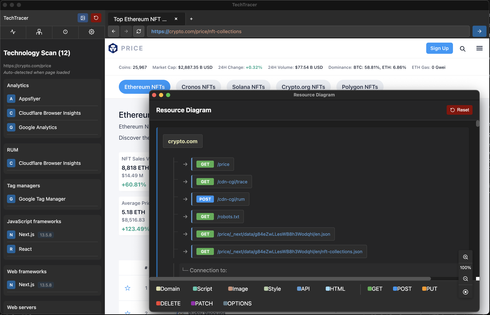

# TechTracer

An application for monitoring and analyzing network traffic, inspecting requests and responses, and visualizing resource Diagrams.



## Features

- Capture and monitor network requests from web applications
- Detailed inspection of request and response headers
- Network flow visualization
- Proxy configuration support
- Integrated browser environment
- Command line URL argument support

## Project Structure

```
tech-tracer/
├── src/                      # Source code
│   ├── main/                 # Main process code
│   │   └── main.js           # Main application entry point
│   ├── renderer/             # Renderer process code
│   │   ├── html/             # HTML files
│   │   └── js/               # Renderer JavaScript files
│   ├── preload/              # Preload scripts for contextBrid
│   └── assets/               # Static assets
└── package.json              # Project configuration
```

## Installation

1. Clone this repository
2. Install dependencies:
   ```
   npm install
   ```
3. Start the app:
   ```
   npm start
   ```

## Usage

### Basic Usage
```
npm start
```

### Open with Specific URL
```
npm start -- --url https://crypto.com/exchange
```

### With Electron Directly
```
electron . --url https://crypto.com/exchange
```

## Building

To build the app for distribution:

```
npm run build
```

## Technical Details

This app demonstrates monitoring and analyzing network traffic:

- Uses Electron's network monitoring APIs to capture requests and responses
- Visualizes network flow with interactive diagrams
- Supports proxy configuration for traffic interception
- Implements IPC (Inter-Process Communication) for secure main/renderer process communication
- Command line arguments support for directly opening specific URLs

## License

MIT
